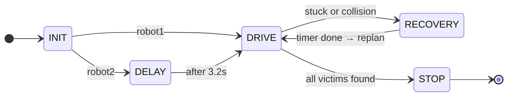
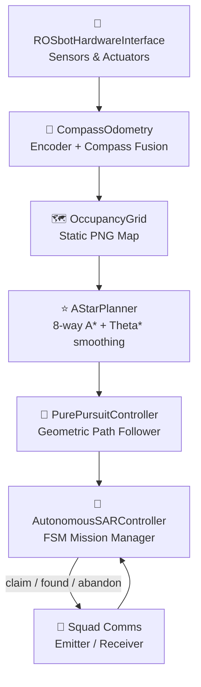

<div align="center">

# 🚁 Team Albatross
### IEEE SMCS 2026 Search & Rescue Competition — Phase 1


*Fully autonomous multi-robot Search & Rescue using A\* planning, Pure Pursuit control, and inter-robot coordination.*

</div>

---

## 📖 Table of Contents

- [What We Built](#-what-we-built)
- [Setup & Environment](#-setup--environment)
- [Pre-Processing Step](#-pre-processing-step)
- [Running the Simulation](#-running-the-simulation)
- [Repository Structure](#-repository-structure)
- [System Architecture](#-system-architecture)
- [Victim Scoring Strategy](#-victim-scoring-strategy)
- [Compliance Checklist](#-compliance-checklist)

---

## 🧠 What We Built

We designed a **cooperative two-robot SAR system** that autonomously navigates a disaster environment, locates victims, and reliably reports their positions — all within a 180-second mission window.

| Feature | Description |
|---|---|
| 🗺️ **Flyover Parsing** | Extracts victim locations and wall geometry from the `.wbt` file to build a mission plan before any robot moves |
| 🤝 **Cooperative Search** | Robots claim victims via a broadcast protocol — no duplicate searches, no wasted time |
| 🎯 **Direct Approach** | Within 1.5 m, robots ditch the planned path and drive straight toward the victim — bypassing sensor noise |
| 📡 **Score Bursting** | Sends repeated score messages while physically at the victim to defeat odometry drift |
| 🔄 **Stuck Recovery** | Detects trapped robots, reverses, spins toward the target, and replans from the new position |

---

## ⚙️ Setup & Environment

### Prerequisites

| Tool | Version | Download |
|---|---|---|
| **Webots** | R2025a | [cyberbotics.com](https://cyberbotics.com/#download) |
| **Python** | 3.10 or newer | [python.org](https://www.python.org/downloads/) |
| **Git LFS** | Any | [git-lfs.com](https://git-lfs.com) |

---

### Step 1 — Clone the Repository

```bash
git lfs install
git clone https://github.com/IEEE-SMCS/2026-ieee-smcs-competition-phase-1
cd 2026-ieee-smcs-competition-phase-1
```

---

### Step 2 — Create the Python Environment

```bash
# Create the virtual environment
python -m venv .venv

# Activate (macOS / Linux)
source .venv/bin/activate

# Activate (Windows)
.venv\Scripts\activate

# Install dependencies
pip install -r controllers/proposed_solution/requirements.txt
```

> **Only two packages are needed:** `numpy` and `Pillow`. Everything else is Python standard library.

---

### Step 3 — Configure Webots

Open Webots → **Tools → Preferences → General** → set **Python command**:

| OS | Path |
|---|---|
| macOS / Linux | `/path/to/repo/.venv/bin/python` |
| Windows | `C:\path\to\repo\.venv\Scripts\python.exe` |

---

## 🛰️ Pre-Processing Step

Before running the simulation, parse the world file to generate the occupancy map and victim coordinates:

```bash
# Small world (default for development)
python controllers/proposed_solution/prepare_mission_plan.py --world worlds/small_world.wbt

# Medium world
python controllers/proposed_solution/prepare_mission_plan.py --world worlds/medium_world.wbt

# Large world
python controllers/proposed_solution/prepare_mission_plan.py --world worlds/large_world.wbt
```

This generates the following files in `sim_logs/`:

```
sim_logs/
├── map_estimate.png              ← Binary occupancy grid (free / wall)
├── map_metadata.json             ← Resolution + world-to-pixel transform
├── victim_location_estimates.csv ← Victim positions relative to OriginMarker ✅
├── victim_world_coords.json      ← Absolute victim coords for A* navigation
├── robot_start_positions.json    ← Robot spawn coordinates
└── origin_marker.json            ← OriginMarker world offset
```

> **These files are pre-committed for `small_world.wbt`** — you only need to re-run if you switch worlds.

---

## ▶️ Running the Simulation

```
Webots → File → Open World → worlds/small_world.wbt → Press ▶ Play
```

Both robots initialise, load the pre-computed plan, and begin the mission automatically. A full mission report is printed to the Webots console when the 180-second timer ends.

---

## 📁 Repository Structure

```
controllers/proposed_solution/
│
├── 🤖 proposed_solution.py       ← Main robot controller (Webots entry point)
├── 🛰️  prepare_mission_plan.py   ← World parser + occupancy-map generator
├── 📋 requirements.txt           ← numpy, Pillow
├── 📐 ARCHITECTURE.md            ← Deep-dive technical notes
├── 📖 README.md                  ← This file
│
└── 📂 sim_logs/                  ← Auto-generated; pre-committed for small_world
    ├── map_estimate.png
    ├── map_metadata.json
    ├── victim_location_estimates.csv
    ├── victim_world_coords.json
    ├── robot_start_positions.json
    └── origin_marker.json
```

> No compiled objects (`.so`, `.dll`, `.pyc`) are included — `__pycache__` is excluded via `.gitignore`.

---

## 🏗️ System Architecture

### Robot Controller FSM

The controller runs as a **Finite State Machine** at 32 ms per tick:



---

### Component Overview



---

### Multi-Robot Coordination

Robots communicate on a shared channel using three JSON message types:

| Message | Sent when | Partner reacts by |
|:---:|---|---|
| `claim_victim` | Robot picks a target | Skipping that victim |
| `victim_found` | Robot finishes scoring | Marking victim as visited |
| `abandon_victim` | Robot gives up (stuck) | Claiming it themselves |

The search area is split at the **median Y-coordinate** of all victims:

```
┌─────────────────────────────────────────┐
│   victim3 ●          victim4 ●          │  ← Robot 1 sector (upper)
│─────────────────────────────────────────│
│   victim1 ●          victim2 ●          │  ← Robot 2 sector (lower)
└─────────────────────────────────────────┘
```

If a robot runs out of victims in its sector, it automatically picks up unclaimed ones from the other half.

---

## 🎯 Victim Scoring Strategy

The supervisor scores a victim **only when the robot's real Webots position is within 1.0 m**. Odometry alone can drift by up to 0.5 m over 5 m of travel, so we use a three-stage approach:

```
┌──────────────────────────────────────────────────────┐
│  1.5 m  │   Abandon A* path, drive directly at victim │
│  0.35 m │   Or IR sensor < 0.20 m (physical contact)  │
│   STOP  │   Send score burst every 8 ticks for 2.5s   │
└──────────────────────────────────────────────────────┘
```

The score **burst** (multiple `victim_found=True` messages while stopped) guarantees the supervisor's real-position check fires at least once while the robot is physically adjacent — regardless of odometry drift. All messages are correct verdicts, so confidence stays at **1.0**.

---

## ✅ Compliance Checklist

| Requirement | Status |
|---|:---:|
| Python 3.10+ (developed on 3.12) | ✅ |
| `proposed_solution.py` at correct path | ✅ |
| `requirements.txt` (`pip install -r` compatible) | ✅ |
| No compiled objects committed | ✅ |
| One-line pre-processing command | ✅ |
| All asset files committed (`sim_logs/`) | ✅ |
| Concise solution explanation | ✅ |

---

<div align="center">

**Team Albatross** · IEEE SMCS 2026 SAR Competition · Phase 1

</div>
